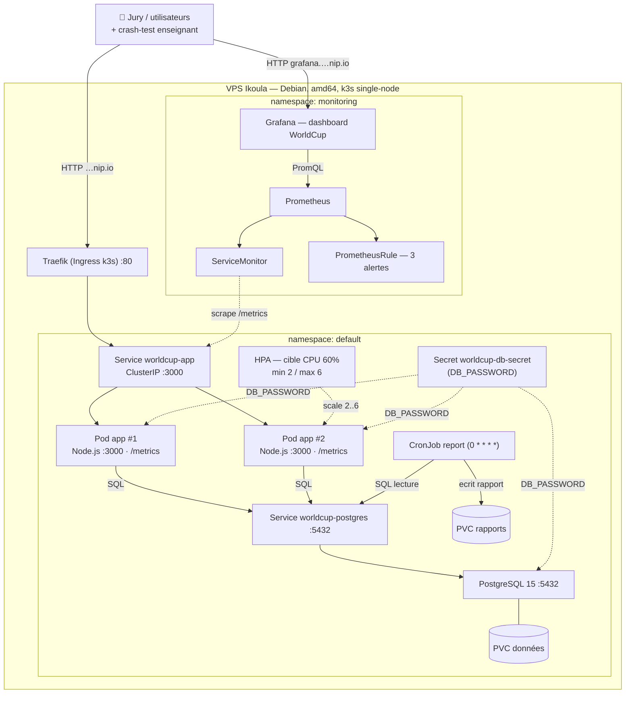

# WorldCup 2026 — Plateforme haute disponibilité

Application **Node.js + PostgreSQL** déployée sur **Kubernetes (k3s)** avec haute
disponibilité, auto-scaling, self-healing, observabilité et CI/CD.

| Service | URL |
| --- | --- |
| 🌍 **Application** | http://178.170.25.230.nip.io |
| 📊 **Grafana** (dashboard + alerting) | http://grafana.178.170.25.230.nip.io |

> Ce README est **autoportant** : tout le nécessaire pour la soutenance est ici
> (archi, garanties + preuves, coûts, déploiement, crash-tests). Les docs
> détaillées ne servent qu'à approfondir un point précis.

## Sommaire

- [Ce qu'on livre](#ce-quon-livre)
- [Architecture](#architecture)
- [Les 4 garanties + preuves live](#les-4-garanties--preuves-live)
- [Sécurité](#sécurité)
- [Coût (FinOps)](#coût-finops)
- [Déploiement](#déploiement)
- [Démarrage local](#démarrage-local)
- [Documentation détaillée](#documentation-détaillée)

---

## Ce qu'on livre

| Besoin client | Garantie | Traduction technique |
| --- | --- | --- |
| « Mon site ne tombe pas » | Service continu si un composant lâche | ≥ 2 réplicas + probes, Service load-balancé |
| « Il se répare tout seul » | Retour en service **< 15 s** | Self-healing K8s (liveness probe) |
| « Il encaisse les pics » | Capacité **x3 automatique** | Auto-scaling HPA 2→6 sur CPU |
| « Je vois ce qui se passe » | Dashboard temps réel + alertes | Prometheus + Grafana + 3 alertes |
| « Je maîtrise mon budget » | **~20 €/mois**, transparent | Dimensionnement calibré, 9× moins cher qu'EKS |
| « Mes données sont protégées » | Aucun secret exposé | Secrets K8s, 0 credential dans Git |

**Stack :** Docker (multi-stage, non-root) · k3s single-node · Helm · Traefik
(Ingress) · PostgreSQL (StatefulSet + PVC) · HPA · kube-prometheus-stack ·
GitHub Actions (build & push GHCR).

---

## Architecture



Détail des flux et composants : [docs/architecture.md](docs/architecture.md).

---

## Les 4 garanties + preuves live

Chaque garantie se démontre en direct sur le VPS (SSH). Garder **Grafana projeté**
en parallèle : le panel *nombre de pods* rend l'élasticité et le self-healing visibles.

### 1. Haute disponibilité — perte d'un pod = 0 interruption

```bash
kubectl delete pod <un-pod-app>
while true; do curl -s -o /dev/null -w "%{http_code}\n" \
  http://178.170.25.230.nip.io/api/health/db; sleep 0.5; done
# → reste 200, aucun 5xx (le Service route vers le pod sain)
```

### 2. Self-healing — reprise chronométrée < 15 s

```bash
kubectl get pods -l app=worldcup-app -w                       # terminal 1
time curl -s http://178.170.25.230.nip.io/api/admin/kill      # terminal 2
# → pod Terminating puis Running en < 15 s, sans intervention
```

### 3. Élasticité — auto-scaling 2 → 6 pods

```bash
watch -n 2 kubectl get hpa,pods -l app=worldcup-app           # terminal 1
hey -z 60s -c 50 http://178.170.25.230.nip.io/api/compute     # terminal 2
# → CPU > 60% → 2 pods deviennent 6, puis retour à 2 après la charge
```

### 4. Observabilité — dashboard temps réel + alertes

Grafana : http://grafana.178.170.25.230.nip.io — panels **req/s · latence p95 ·
taux 5xx · CPU · nombre de pods**. 3 alertes (app down, 5xx élevé, latence
dégradée). Détails : [docs/bloc4-observabilite.md](docs/bloc4-observabilite.md).

---

## Sécurité

- `DB_PASSWORD` en **Secret K8s** injecté par `secretKeyRef` — **jamais en clair dans Git**.
- Vérifiable : `grep -ri password charts/ app/` → uniquement des `secretKeyRef`.
- Image Docker **multi-stage**, exécutée en **user non-root** (voir [OPTIMISATION.md](OPTIMISATION.md)).

---

## Coût (FinOps)

| | **Notre solution (k3s)** | Cloud managé (EKS multi-AZ) |
| --- | --- | --- |
| **Prix / mois** | **~20 €** (0 € réel, VPS fourni) | ~175 € |
| Disponibilité | Niveau applicatif (pod) | Niveau infra (multi-AZ) |
| Mise en service | 1 commande Helm, reproductible | Idem, plus lourde |
| Pertinence projet | ✅ Le bon calibre | Surdimensionné ici |

**Budget ÷ 9 pour ce périmètre, même package Helm** → bascule EKS triviale à
l'échelle. Dimensionnement chiffré et hypothèses : [docs/finops.md](docs/finops.md).

---

## Déploiement

Sur le VPS (k3s), en une commande :

```bash
source deploy/.env   # IMAGE_TAG, DB_PASSWORD, GRAFANA_ADMIN_PASSWORD
helm upgrade worldcup charts/worldcup \
  --set image.tag=$IMAGE_TAG \
  --set db.password=$DB_PASSWORD
```

**CI/CD :** chaque push sur `main` build et pousse l'image sur GHCR
(GitHub Actions). Procédure complète (branche non mergée, stack monitoring) :
[docs/deploy-prod.md](docs/deploy-prod.md).

---

## Démarrage local

```bash
cp .env.example .env
docker compose up --build --wait
```

---

## Documentation détaillée

> Non nécessaire pendant la présentation — pour approfondir un point.

| Doc | Contenu |
| --- | --- |
| [docs/architecture.md](docs/architecture.md) | Schéma d'architecture + flux et composants |
| [docs/finops.md](docs/finops.md) | Estimation de coût + comparaison EKS |
| [docs/argumentaire-soutenance.md](docs/argumentaire-soutenance.md) | Justification du choix k3s, réponses au jury |
| [docs/deploy-prod.md](docs/deploy-prod.md) | Déploiement prod (avec/sans branche mergée) |
| [docs/bloc2-k3s.md](docs/bloc2-k3s.md) | Installation et configuration k3s |
| [docs/bloc3-helm.md](docs/bloc3-helm.md) | Chart Helm — structure et valeurs |
| [docs/bloc4-observabilite.md](docs/bloc4-observabilite.md) | Stack Prometheus + Grafana |
| [docs/bloc6-job.md](docs/bloc6-job.md) | Job créatif (CronJob rapport) |
| [docs/publish-image.md](docs/publish-image.md) | Publier l'image Docker sur GHCR |
| [docs/GUIDE-ETUDIANT.md](docs/GUIDE-ETUDIANT.md) | Routes API, variables d'environnement |
| [PROJECT.md](PROJECT.md) | Énoncé du projet, grille d'évaluation |
