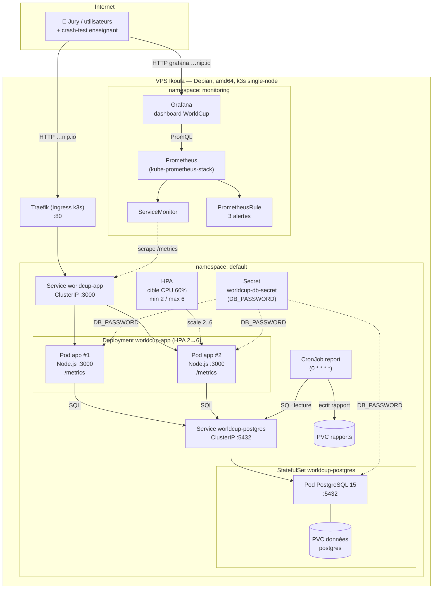

# Architecture

> Schéma de l'infrastructure déployée : VPS Ikoula → cluster k3s single-node →
> app Node.js + PostgreSQL, exposés via Traefik, observés par Prometheus/Grafana.

L'URL publique en tête du [README](../README.md). Tout tourne sur **un seul VPS**
(k3s single-node) — le point faible assumé à l'oral (voir
[argumentaire-soutenance.md](argumentaire-soutenance.md)).

---

## Vue d'ensemble

---

## Flux et composants

| Composant | Rôle | Preuve en soutenance |
| --- | --- | --- |
| **Traefik (Ingress)** | Fourni par k3s, route `…nip.io` → Service app sur `:80` | URL publique répond |
| **Deployment `worldcup-app`** | 2 réplicas Node.js, probes `liveness`/`readiness` sur `/api/health/db` | Kill d'un pod → l'autre absorbe |
| **HPA** | Scale 2→6 pods si CPU moyen > 60 % | Load test `/api/compute` → pods montent |
| **Service (ClusterIP)** | Load-balancing interne entre pods app | — |
| **StatefulSet PostgreSQL** | Base persistante (PVC), init via ConfigMap `init.sql` | `/api/data`, `/api/votes/results` |
| **Secret K8s** | `DB_PASSWORD` injecté par `secretKeyRef` — jamais en clair dans Git | `grep` sur le repo = 0 credential |
| **CronJob report** | Lit la BDD toutes les heures, écrit un rapport horodaté dans un PVC | `docs/bloc6-job.md` |
| **kube-prometheus-stack** | Prometheus scrape `/metrics` via ServiceMonitor, Grafana affiche le dashboard, PrometheusRule porte 3 alertes | Dashboard live pendant le crash-test |

## Sources (single source of truth)

- Chart Helm : [`charts/worldcup/`](../charts/worldcup) — valeurs dans [`values.yaml`](../charts/worldcup/values.yaml)
- Monitoring : [`monitoring/`](../monitoring), doc [bloc4-observabilite.md](bloc4-observabilite.md)
- Déploiement : [deploy-prod.md](deploy-prod.md)
